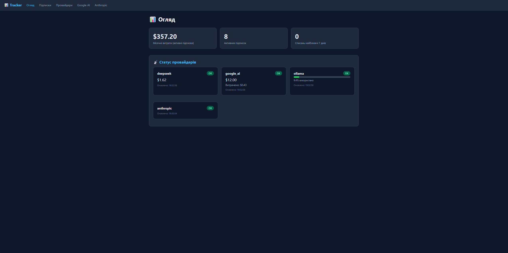
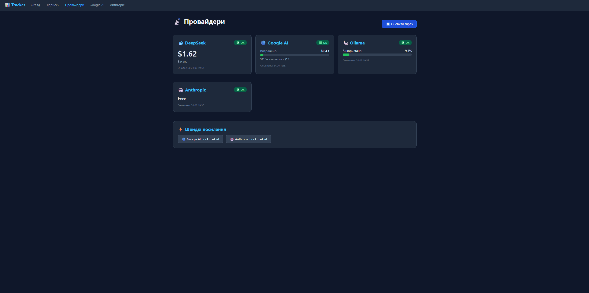
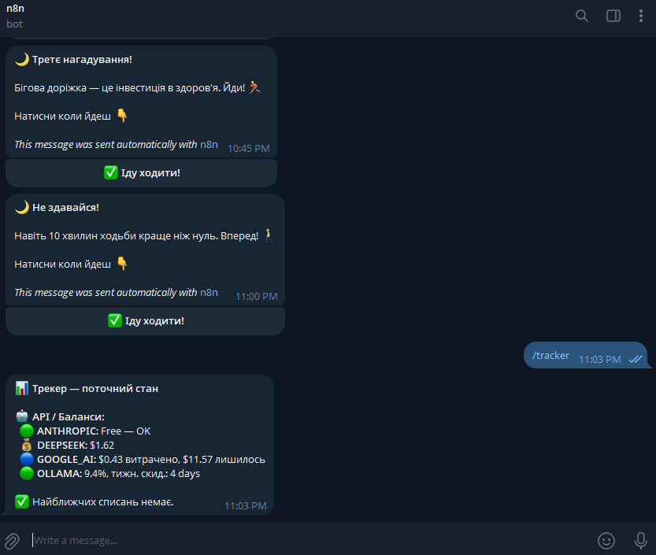

# Subscription Tracker

`Subscription Tracker` is a self-hosted FastAPI app for keeping recurring
software costs, renewal dates, and AI provider balances in one place.

It combines a small dashboard, background polling jobs, Telegram reminders, and
manual update flows for providers that do not expose a clean API. The goal is
simple: keep a clear operational view of what is about to renew, what has
already been paid, and which providers are close to their limits.

## What it does

- tracks subscriptions, renewal dates, and payment history
- polls supported providers for balance or usage status
- sends Telegram updates and acknowledgement flows
- keeps the interface lightweight enough to run as a small self-hosted service

## What this project shows

- FastAPI app with HTML dashboard and JSON API
- SQLAlchemy models and recurring reminder logic
- Background schedulers for provider polling and reminder checks
- Telegram notifications with inline acknowledgement buttons
- Real-world glue code for API-based and browser-assisted status collection

## Screenshots

### Overview dashboard



### Provider status



### Telegram status message



## Stack

- Python / FastAPI
- SQLAlchemy
- Jinja2 templates
- APScheduler
- SQLite
- Docker / Docker Compose

## Running locally

1. Copy the example environment file:

```bash
cp .env.example .env
```

2. Install dependencies locally:

```bash
python3 -m venv venv
./venv/bin/pip install -U pip
./venv/bin/pip install -r requirements.txt
```

3. Run the app:

```bash
./venv/bin/uvicorn src.main:app --reload --host 0.0.0.0 --port 5010
```

Or start it with Docker:

```bash
docker compose up --build
```

## Environment notes

- `DB_PATH`: SQLite database path
- `DEEPSEEK_API_KEY`, `GOOGLE_API_KEY`: provider API access
- `GOOGLE_COOKIE`, `OLLAMA_COOKIE`: browser-assisted provider checks
- `TELEGRAM_BOT_TOKEN`, `TELEGRAM_CHAT_ID`: Telegram status and reminder delivery
- `N8N_CALLBACK_URL`: optional callback forwarder for shared Telegram button flows
- `PUBLIC_BASE_URL`: base URL used by public bookmarklet-style flows

## Public repo notes

This public version excludes live credentials, runtime databases, backup files,
and exported workflow data from the production system. It is intended to show the
architecture and implementation patterns, not the live operational state.
